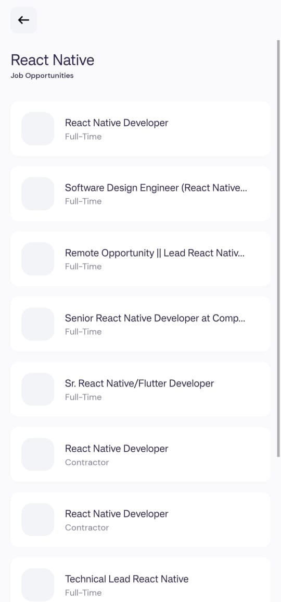

Here’s the updated `README.md` file with the **Technologies Used** section included:  

---

# Job Finder

My second project is the Job Finder app, which I built using React Native. It helps users discover and apply for jobs seamlessly, with a focus on an intuitive user interface and functionality.

---

## Screenshots

### Home Screen  


### Job Details Screen  


### Favorites Search  


---

## Installation

1. Clone the repository:
   ```bash
   git clone https://github.com/IAmKrishThakkar/JobFinder.git
   cd JobFinder
   ```

2. Install Dependencies:
   ```bash
   npm install
   ```

3. Run the App:
   - For Android:
     ```bash
     npm run android
     ```
   - For iOS:
     ```bash
     npm run ios
     ```

---

## Technologies Used

- **React Native**: Framework for building cross-platform mobile apps.  
- **Expo**: A platform for React Native apps.  
- **Axios**: To handle API calls.  
- **Async Storage**: For storing user preferences locally.  
  
